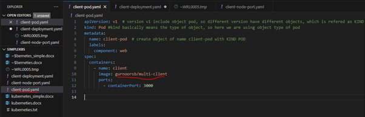
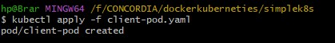
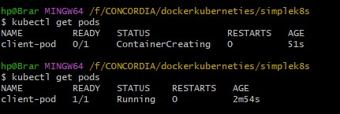
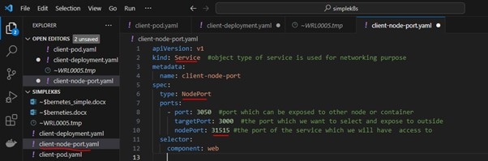
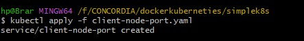
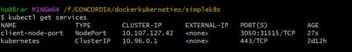
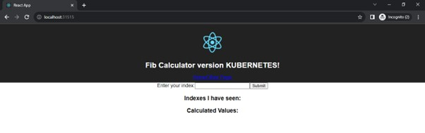

KUBERNETES INITIAL

# Deploying a simple frontend for react app on Kubernetes cluster on local using DOCKER DESKTOP
Before we start, make sure the image which you want to make use of is already pushed onto the Dockerhub.
	Write a simple yaml file for running the single pod for our client 

 

apiVersion : version v1 include the object type of pod
Kind : it is the type of object, so here it is POD
Labels : used as an label which will be used to refer or call this pod by our service object
Image : make use of image that already exists on docker hub

 
 

NOW we need to create Service Object in order to expose our pod to the local machine so that it can be accessed from our local machine, So we will be using service type of NODEPORT. 
This type of service exposes the service on a static port on each node in the cluster. It makes the service accessible externally by using any of the node's IP addresses along with the specified port.
sdsd
So we will create another file named client-node-port.yaml 

 

As we are using Dockerhub for Kubernetes as well, so we can access the service from our local :
http://localhost:31515/ 
 
